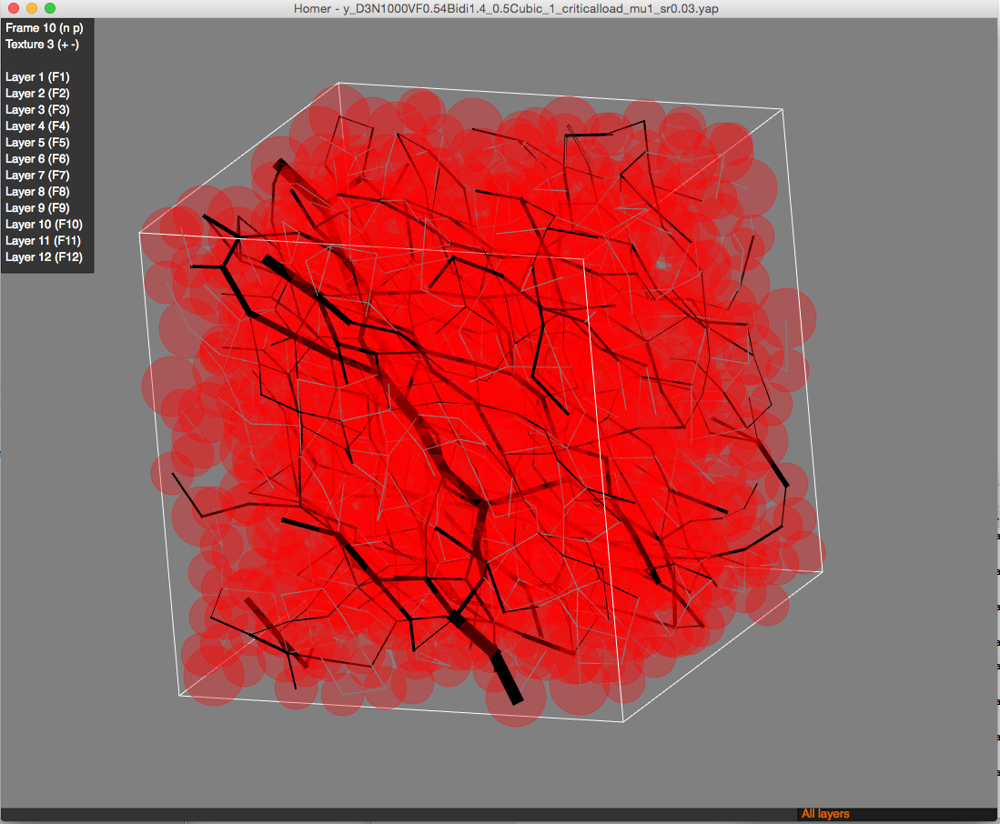

<h1> Homer </h1>



Homer is a program to visualize computer simulations data (typically
Molecular Dynamics data) in an easy manner. It is developed to replace
Yaplot (https://github.com/vitroid/Yaplot), mainly because Yaplot's
code depends on now obsolete libraries that makes it hard to install
on a recent machine. Homer is thus so far a clone of Yaplot, based on
the same idea of a simple set of commands interpreted to render an
intentionally basic representation of 3D data.

Homer is still in development stage, so some bugs or early design
flaws are to be expected :) Also, so far not all of Yaplot features are available.

<h2> Installation </h2>

Homer needs a Python 2.7 interpreter and the numpy, pandas and PySide
packages.

You can run Homer as follows:

```
$ python path_to_homer/src/homer.py your_command_file
```

<h2> Data format </h2>

Currently, Homer supports the following subset of Yaplot's data format:

| Command | Result |
|---------|--------|
| Empty line | New frame |
| @ [0-6] | Set the color of following objects (see default color palette below) |
| y [1-12] | Set the layer of following objects |
| r x | Set the thickness/radius of following objects to x | 
| l x1 y1 z1 x2 y2 z2 | Draw a line from 1 to 2 |
| s x1 y1 z1 x2 y2 z2 | Draw a stick (line with thickness) from 1 to 2 |
| c x y z | Draw a circle centered on x,y,z |

<h2> Control commands </h2>

| Command | Result without prefix | Result with number i prefix |
|---------|------------------------------|---------------------------|
| Mouse left-button drag  | Rotate field of view | - |
| Shift + Mouse left-button drag  | Translate filed of view | - |
| Tab | Reset rotation and translation | - |
| * | Zoom in | - |
| / | Zoom out | - |
| + | Increase opacity | - |
| - | Decrease opacity | - |
| n | Next frame | Move forward by i frames |
| p | Previous frame | Move backward by i frames |
| N | Forward movie | - |
| P | Backward movie | - |
| Space | Stop movie | - |
| g | Move to the first frame | Move to frame i |
| G | Move to the last frame | - |
| [F1 - F12] | Switch on/off layer [1-12] | - |
| v | Switch on/off top left information text |